# Отчет по практике

*Тема: применение нейросетевых моделей для генерации сезонных вариантов аэро- и спутниковых снимков и оценка качества промптов.*

## Задание на практику

В ходе практики необходимо разобрать промпты для генерации изображений одной местности в разные времена года, получить результаты, сравнить их между собой и выбрать наиболее удачные формулировки. Работа связана с подготовкой дополнительных изображений для задач компьютерного зрения на аэро- и спутниковых снимках.

Подбор промптов относится к этапу создания обучающей выборки. От качества этого этапа зависит, какие примеры получит модель при дальнейшем обучении и насколько правильно она будет реагировать на разные условия съемки.

Главная тема работы - задача поиска изменений. В ней сравниваются два снимка одной территории, полученные в разные моменты времени. По результату сравнения нужно понять, какие области действительно изменились. Для такой задачи важно, чтобы модель умела отличать реальные изменения объектов от внешних отличий, связанных со временем года, освещением, снегом, растительностью и другими условиями съемки.

В рамках практики рассматривается сезонная генерация. Для исходного изображения нужно получить летний, зимний, осенний и другие варианты той же сцены. При этом итоговое изображение должно сохранять расположение дорог, зданий, границ участков и других важных объектов. Меняться должны только сезонные признаки.

## Цель работы

Цель работы - подобрать и оценить промпты, которые позволяют получать сезонные варианты исходного изображения для расширения обучающей выборки. Подходит тот результат, где видно заданное время года, сохраняется исходная сцена и не появляются случайные изменения, мешающие дальнейшему сравнению.

Для достижения этой цели нужно:

- описать задачу поиска изменений на аэро- и спутниковых снимках;
- определить, почему обучающих данных для такой задачи часто недостаточно;
- разобрать способы расширения обучающей выборки;
- подготовить промпты для сезонной генерации;
- сравнить полученные изображения;
- выбрать лучшие формулировки промптов;
- описать итоговые результаты работы.

## Входные данные

На вход берутся исходные изображения территории и текстовые промпты, по которым генерируются новые сезонные изображения. Для задачи поиска изменений также важен формат пары снимков: изображение до изменений, изображение после изменений и маска, где отмечены измененные области.

При подготовке промптов учитываются:

- исходная сцена;
- требуемое время года;
- сезонные признаки, которые нужно получить;
- элементы местности, которые должны сохраниться;
- нежелательные изменения, которые нужно запретить;
- пригодность результата для сравнения с исходным изображением.

Главное требование к входным данным - возможность связать сгенерированное изображение с исходной сценой. Если после генерации меняется сама местность, результат нельзя использовать как сезонное состояние того же объекта.

## Выходные данные

На выходе должны быть сгенерированные изображения, результаты их сравнения и выбранные промпты. Каждый результат оценивается не только по внешнему виду, но и по пригодности для задачи поиска изменений.

Удачным считается результат, который:

- соответствует заданному времени года;
- сохраняет структуру исходной сцены;
- не меняет расположение дорог, зданий и границ участков;
- не добавляет новые объекты без необходимости;
- не удаляет важные элементы местности;
- подходит как дополнительный пример для обучающей выборки.

Не подходит результат, где изображение выглядит как другая территория. Он может быть правдоподобным, но для этой работы бесполезен: по нему нельзя проверить влияние промпта на исходную сцену.

## Описание работы

### 1. Введение в задачу поиска изменений

Поиск изменений на аэро- и спутниковых снимках строится на сравнении двух изображений одной территории. Первый снимок показывает состояние территории до изменений, второй - после. Результатом работы модели должна стать маска, где выделены области со значимыми изменениями.

Обычно такая задача связана с анализом застройки, дорог, полей, промышленных площадок и других объектов. Такие снимки используют при наблюдении за территориями, сельскохозяйственными участками, городской средой и природными зонами. На снимке может появиться новое здание, измениться участок дороги, исчезнуть объект или поменяться состояние территории. Для обучения модели такие случаи нужно задавать не только изображениями, но и разметкой. В задачах поиска изменений разметка часто задается маской: белые области показывают изменение, черные - фон без изменения.

Пример формата данных для поиска изменений:

| Снимок до изменений | Снимок после изменений | Маска изменений |
| --- | --- | --- |
| 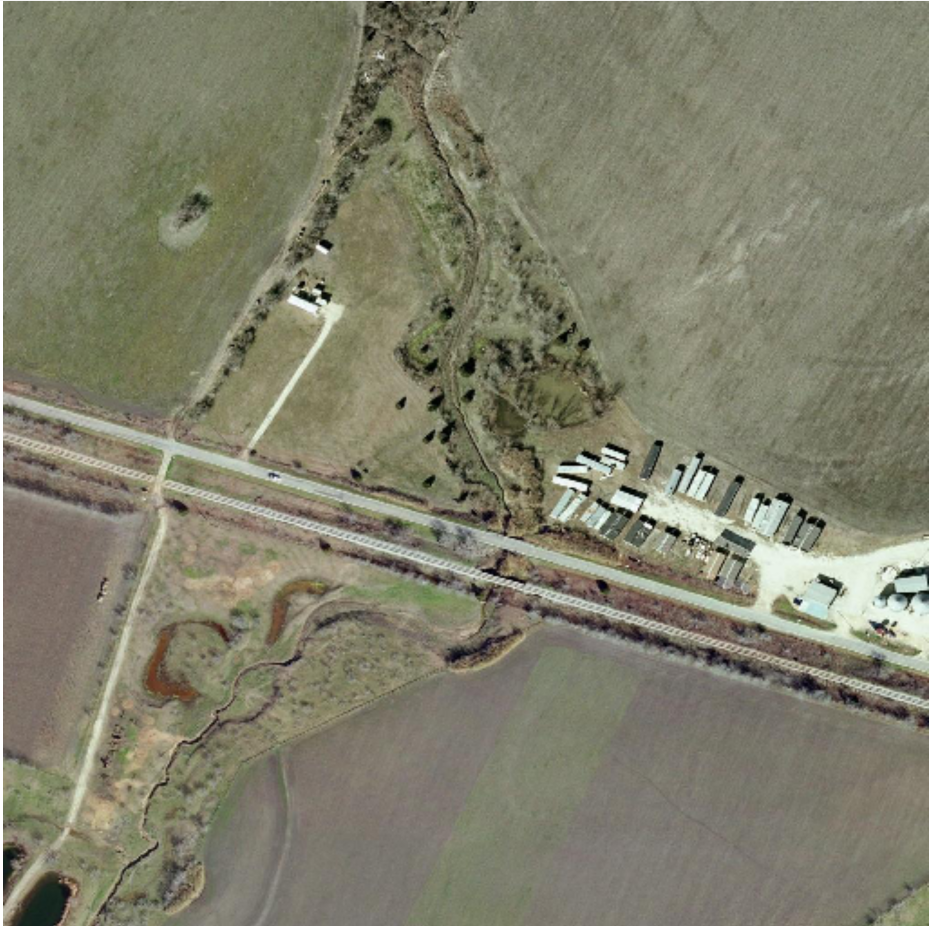 | 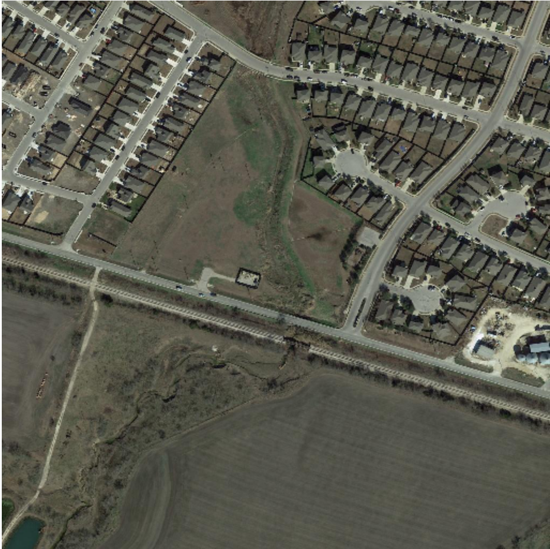 | 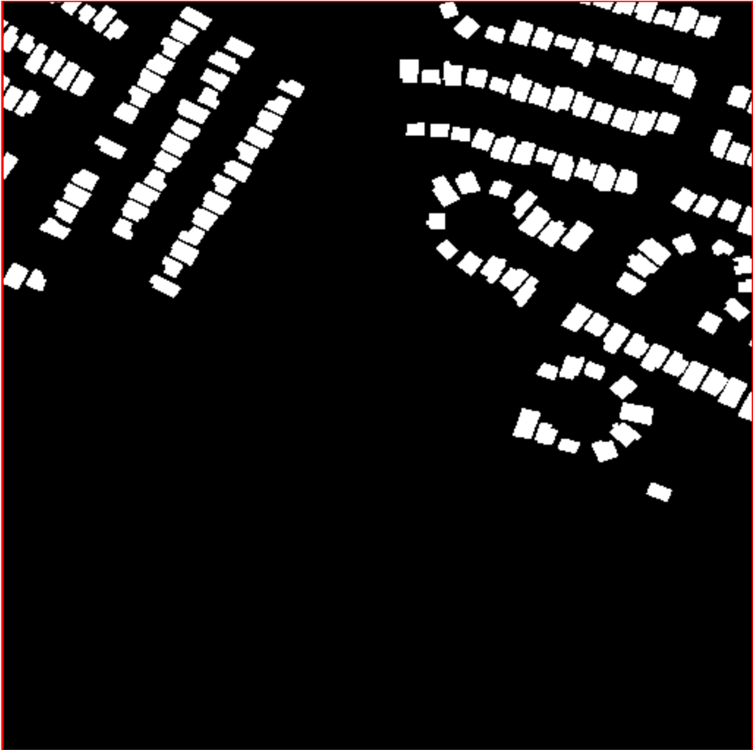 |

Главная сложность состоит в том, что не каждое отличие между снимками означает реальное изменение объекта. Снег, тени, другое освещение, влажность поверхности или сезонная растительность могут сильно менять вид территории. При этом дорога, здание или участок земли могут остаться на том же месте и в той же форме.

Если обучающие данные однотипные, модель может ошибаться. Например, она может принять снег за изменение объекта или не распознать важный объект из-за другого цвета поверхности. Поэтому для такой задачи нужны изображения одной и той же местности в разных условиях. Сезонная генерация помогает получить такие примеры без ожидания реальной съемки в каждый сезон.

### 2. Нейросетевые модели и нехватка обучающих данных

Нейросетевые модели обучаются на примерах. Для задачи поиска изменений одного изображения недостаточно: нужны связанные пары снимков и точная маска изменений. Подготовка таких данных занимает много времени, потому что нужно подобрать снимки одной территории, совместить их и отметить только те области, где действительно произошло изменение.

Данных часто не хватает по нескольким причинам. Во-первых, не для каждой территории есть снимки в разные периоды. Во-вторых, снимки могут отличаться масштабом, разрешением, качеством, освещением и сезоном. В-третьих, ручная разметка масок требует внимательной проверки, иначе модель будет обучаться на ошибочных примерах.

Для сезонной генерации эта проблема особенно заметна. Хорошо, если есть исходный снимок одной местности, но редко есть набор реальных снимков этой же сцены летом, зимой и осенью. Если в выборке преобладает один сезон, модель хуже видит другие состояния территории. Из-за этого она может плохо понимать, какие отличия связаны с временем года, а какие с реальными изменениями объектов.

Расширение обучающей выборки помогает снизить эту проблему. Дополнительные изображения показывают модели больше состояний одной территории. В этой работе важно не случайное создание новых сцен, а получение сезонных вариантов исходного изображения. Это полезно только при одном условии: генерация должна менять внешний вид, но не должна ломать геометрию сцены.

Поэтому промпт в этой работе рассматривается как инструмент управления генерацией. Он должен задавать сезон и одновременно ограничивать лишние изменения. Хороший промпт помогает получить изображение, где видны признаки нужного времени года, но сохраняются дороги, здания, поля, парковки и границы участков.

### 3. Типы расширения обучающей выборки

Расширять обучающую выборку можно разными способами. Самый простой способ - применить к изображению обычные преобразования. К ним относятся повороты, отражения, масштабирование, кадрирование, изменение яркости, размытие, дефокус, добавление шума, тумана, дождя, снега, теней и солнечных бликов.

Такие преобразования помогают сделать набор данных разнообразнее. Модель видит объекты в разных положениях, при разном освещении и с разными визуальными помехами. Это снижает зависимость от одного конкретного вида снимка.

Для задач поиска изменений важно различать одиночные и парные преобразования. Одиночные преобразования применяются к одному изображению. Например, можно добавить шум, туман или снег. Парные преобразования применяются сразу к снимку до изменений, снимку после изменений и маске. К ним относятся поворот, отражение, кадрирование, масштабирование и другие операции, которые должны одинаково изменить все связанные данные. Если повернуть только одно изображение, пара перестанет совпадать, и такой пример нельзя будет использовать для обучения.

Пример обычного сезонного преобразования:

| Исходное изображение | Изображение после добавления снега |
| --- | --- |
|  |  |

Обычные преобразования полезны, но у них есть ограничение. Они меняют изображение технически: добавляют шум, изменяют яркость, поворачивают или масштабируют кадр. Такие операции не всегда дают полноценный сезонный вид территории. Например, простое добавление снега может не изменить состояние растительности, цвет открытых участков или общий вид сцены.

Генерация по промптам решает другую задачу. Она позволяет описать нужное состояние словами: зимний вид, осенняя растительность, летняя зелень, глубокая зима, снежный покров. Поэтому в этой работе обычные преобразования рассматриваются как базовый способ расширения данных, а сезонная генерация - как более управляемый способ получить новые состояния той же сцены.

### 4. Создание изображений с разными временами года

Главная часть работы связана с созданием сезонных изображений. Из одного исходного снимка нужно получить несколько вариантов той же местности: лето, зиму, глубокую зиму, осень и другие состояния. Для летнего вида важны зеленая растительность и сухие открытые участки, для осени - изменение цвета растительности, для зимы - снежный покров, а для глубокой зимы - более выраженное покрытие снегом. Такой набор помогает проверить, насколько промпты позволяют менять сезон без изменения самой сцены.

Пример сезонной генерации:

| Исходное изображение | Лето | Зима |
| --- | --- | --- |
| 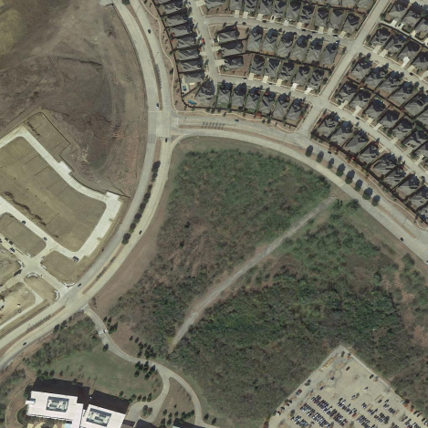 |  | 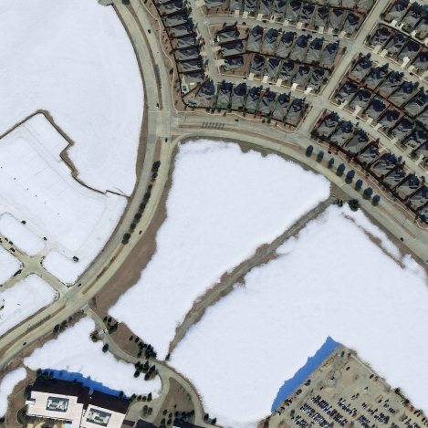 |

| Глубокая зима | Осень |
| --- | --- |
| 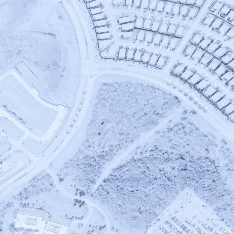 | 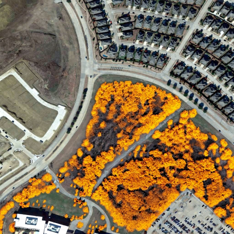 |

При генерации важно сохранить основу изображения. Дороги должны оставаться дорогами, здания - зданиями, а границы участков не должны смещаться. Допустимыми считаются изменения, которые связаны с сезоном: снег на открытых участках, изменение цвета растительности, осенние оттенки, более светлая или более холодная общая цветовая гамма.

Недопустимыми считаются изменения, которые создают новую сцену. К ним относятся появление новых зданий, исчезновение дорог, изменение формы кварталов, искажение парковок, сильное смещение объектов или появление деталей, которых не было на исходном снимке. Такие ошибки особенно опасны для задачи поиска изменений, потому что модель может принять их за реальные изменения территории.

Оценка промптов строится вокруг трех вопросов. Первый - соответствует ли изображение заданному времени года. Второй - сохранилась ли исходная структура сцены. Третий - нет ли случайных изменений, которые мешают использовать результат как дополнительный пример.

На практике хороший промпт должен быть не только описательным, но и ограничивающим. Недостаточно написать, что нужно получить зиму или осень. Нужно также явно указать, что надо сохранить расположение объектов и не добавлять новые строения, дороги или крупные элементы. Поэтому дальнейшая часть работы будет связана с подбором разных формулировок промптов, их сравнением и выбором тех, которые дают наиболее стабильный результат.

### 5. Подготовка промптов для генерации изображений

Промпт - это текстовое задание, по которому модель формирует результат. В работе он используется для управления сезонной генерацией. Он должен не просто описывать нужное время года, а задавать условия, при которых исходная сцена сохраняется.

При подготовке промпта важно учитывать три части. Первая часть описывает, что нужно получить: например, зимний, осенний или летний вид той же территории. Вторая часть фиксирует, что должно остаться без изменений: дороги, здания, парковки, границы участков и общий ракурс. Третья часть задает ограничения: не добавлять новые крупные объекты, не менять планировку местности и не превращать снимок в другую сцену.

Инструкцию лучше строить в одном порядке. Сначала задается основная задача, затем описывается исходный тип изображения, после этого перечисляются нужные сезонные признаки и ограничения. Такой порядок снижает неоднозначность: модель получает не набор случайных слов, а понятное задание.

Для сравнения промптов важно менять только одну часть инструкции. Например, если сравниваются лето, осень и зима, базовая часть промпта должна оставаться одинаковой, а меняться должен только сезонный блок. Тогда можно понять, какая формулировка влияет на результат, а не смешивать влияние разных условий.

Работу с промптами удобно вести поэтапно. Сначала составляется простой промпт, который задает только сезон. Затем результат проверяется: сохранилась ли структура сцены, появились ли нужные сезонные признаки, нет ли лишних объектов. После этого промпт уточняется. Так проще не перегружать инструкцию сразу и постепенно находить формулировку, которая дает более стабильный результат.

Для сезонной генерации особенно важны слова, которые описывают состояние поверхности и растительности. Для зимы это снежный покров, холодная цветовая гамма и отсутствие летней зелени. Для осени - желтые и оранжевые оттенки растительности. Для лета - зеленая растительность, сухие дороги и открытые участки без снега. При этом в каждом случае нужно отдельно указывать, что геометрия сцены должна сохраниться.

Также нужно фиксировать условия генерации. Если каждый раз менять не только промпт, но и параметры генерации, сравнение станет неточным. Поэтому для проверки лучше использовать одно исходное изображение, один набор основных настроек и одинаковые критерии оценки. В этом случае различия между результатами можно связывать именно с промптами.

В работе промпт можно записывать как шаблон:

| Часть промпта | Что описывает | Пример для этой задачи |
| --- | --- | --- |
| Основная задача | Какой результат нужен | Получить сезонный вид той же территории |
| Контекст | Тип изображения и область применения | Аэро- или спутниковый снимок местности |
| Сезонные признаки | Что должно измениться | Снег, цвет растительности, состояние открытых участков |
| Сохраняемые элементы | Что нельзя менять | Дороги, здания, парковки, границы участков |
| Ограничения | Что нужно исключить | Новые строения, новые дороги, смена ракурса, искажения |

По такому шаблону можно быстро составить несколько сопоставимых промптов. Например, один промпт для летнего вида, второй для осеннего, третий для зимнего. При этом структура инструкции остается одинаковой, а меняется только описание сезона.

### 6. Типы промптов

Для работы можно выделить несколько типов промптов. Они отличаются тем, как задается инструкция и насколько подробно описывается ожидаемый результат.

Прямой промпт, или zero-shot, задает задачу одной короткой инструкцией без примеров. Например, можно попросить получить зимний вид исходного снимка. Такой тип подходит для первого опыта и для базовой проверки модели. Его недостаток в том, что модель сама решает, какие детали менять, поэтому результат может оказаться слишком свободным.

Контекстный промпт добавляет условия задачи. В нем указывается, что изображение относится к аэро- или спутниковому снимку, что нужно сохранить исходную структуру территории и изменить только сезонные признаки. Такой промпт лучше подходит для данной работы, потому что он связывает генерацию с задачей поиска изменений, а не просто просит создать красивый зимний или осенний кадр.

Положительный промпт описывает то, что должно появиться на изображении. Для сезонной генерации в него входят нужное время года, цвет растительности, наличие снега, состояние поверхности и общий вид сцены. Он отвечает на вопрос, какой результат нужно получить.

Отрицательный промпт описывает то, чего быть не должно. В него можно включить запрет на новые здания, новые дороги, изменение формы кварталов, исчезновение объектов, сильное искажение снимка и смену ракурса. Такой промпт особенно важен, потому что задача состоит не в создании новой красивой картинки, а в получении сезонного состояния той же местности.

Промпт с примерами, или one-shot/few-shot, используется, когда нужно показать модели один или несколько образцов ожидаемой формулировки. Такой подход полезен при подготовке набора однотипных промптов: например, отдельно для лета, осени, зимы и глубокой зимы. Он помогает держать одинаковую структуру описания и уменьшает разброс между промптами.

CoT-промпт, или Chain-of-Thought, строится как пошаговая инструкция. В обычных текстовых задачах он предлагает модели сначала разобрать задачу по шагам, а потом дать ответ. В этой работе он полезен не как финальный промпт для генерации, а как способ подготовить промпт. Сначала можно попросить модель выделить, какие элементы сцены нужно сохранить и какие сезонные признаки добавить, а затем на основе этого составить короткий итоговый промпт для генерации.

Step-back промпт близок к CoT, но сначала задает более общий вопрос. Например, перед составлением промпта можно определить, какие признаки отличают зимний снимок от летнего и какие элементы должны остаться неизменными. После этого проще составить конкретную инструкцию для генерации. В этой работе он помогает не забыть важные условия: сезон должен измениться, а структура местности должна сохраниться.

Декомпозиционный промпт разбивает задачу на несколько простых шагов. Для сезонной генерации это удобно: отдельно описывается изменение времени года, отдельно - сохранение объектов, отдельно - запрет лишних изменений, отдельно - критерии проверки результата. Такой промпт помогает подготовить более точную итоговую инструкцию.

Также можно использовать уточняющий промпт. Он применяется после просмотра результата. Если модель добавила лишние объекты или изменила дороги, следующая формулировка должна прямо запретить эти изменения. Если сезон выражен слабо, промпт уточняется через более конкретные признаки: плотность снега, цвет растительности, состояние открытых участков и общий тон изображения.

Для удобства сравнения типы промптов можно свести в таблицу.

| Тип промпта | Для чего используется | Польза для сезонной генерации |
| --- | --- | --- |
| Zero-shot | Быстрая проверка простой инструкции | Показывает базовое поведение модели |
| Контекстный | Добавляет область задачи и ограничения | Связывает результат с аэро- или спутниковым снимком |
| Положительный | Описывает нужные признаки | Задает сезон, цвет, снег, состояние поверхности |
| Отрицательный | Описывает нежелательные признаки | Помогает убрать новые объекты, смену ракурса и искажения |
| One-shot/few-shot | Использует один или несколько примеров | Помогает держать одинаковую структуру промптов |
| CoT | Разбирает задачу по шагам | Помогает подготовить итоговый промпт |
| Step-back | Начинает с общего вопроса | Помогает выделить признаки сезона и сохраняемые элементы |
| Декомпозиционный | Делит задачу на части | Упрощает контроль результата |

Для дальнейшего сравнения лучше использовать не один случайный промпт, а несколько типов формулировок. Это позволит проверить, какие инструкции лучше сохраняют исходную сцену и при этом дают заметный сезонный эффект.

### 7. Собственное решение

Для практической части было реализовано рабочее решение, которое принимает исходные снимки, применяет к ним набор промптов для сезонной генерации, сохраняет результаты и оценивает их по числовым метрикам. Решение запускается из командной строки и построено вокруг четырех шагов: генерация, оценка, проверка, сравнение.

Схема процесса:

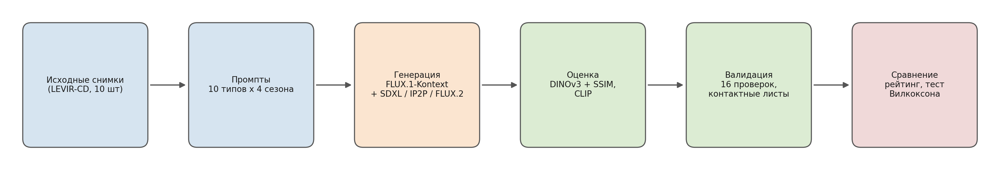

В качестве исходных данных используются десять снимков «до изменений» из открытого набора LEVIR-CD - эталонного набора для задачи поиска изменений (снимки 1024 x 1024, разные территории). Загрузка подвыборки автоматизирована и воспроизводима: при повторном запуске выбираются те же снимки.

#### 7.1. Организация и воспроизводимость

Все настройки хранятся отдельно от кода. Исходные снимки лежат в отдельной папке, промпты описаны в отдельном файле, параметры генерации и оценки заданы в файле конфигурации. Каждый запуск генерации создает свою папку результата, в которую сохраняются сгенерированные изображения, файл с параметрами каждой генерации и снимок использованных настроек. Прошлые запуски не перезаписываются.

Для честного сравнения промптов все параметры генерации фиксируются: одинаковое исходное изображение, одинаковое число шагов, одинаковая сила подсказки и фиксированное начальное значение генератора случайных чисел. Меняется только то, что сравнивается, - тип промпта или сезон. Благодаря фиксации параметров и сохранению метаданных любой результат можно воспроизвести.

#### 7.2. Чтение и запись снимков

Чтение и запись изображений выполняются через библиотеку GDAL, которая поддерживает форматы дистанционного зондирования и сохраняет географическую привязку снимка. Если GDAL не установлен, используется библиотека Pillow. Снимок приводится к трехканальному виду, масштабируется к рабочему разрешению, а после генерации сохраняется обратно.

#### 7.3. Модель генерации

В качестве основной модели используется FLUX.1-Kontext - инструкционный редактор изображений. В отличие от обычной генерации по тексту, он принимает исходное изображение и текстовую команду и редактирует сцену, а не рисует ее заново. Это важно для задачи: модель по своей природе старается сохранить исходную структуру и меняет только то, что описано в команде.

Дополнительно для сравнения подходов подключены еще три модели: Stable Diffusion XL в режиме image-to-image, InstructPix2Pix и FLUX.2 - более крупный редактор следующего поколения (32 миллиарда параметров против 12 у основной модели). Все они работают через единый интерфейс: на вход подается снимок и запрос, на выходе - отредактированное изображение того же размера. Это позволяет прогнать одинаковый набор промптов через разные модели и сравнить их по одним и тем же метрикам.

#### 7.4. Промпты

Реализовано десять типов промптов, по четыре сезона в каждом (лето, осень, зима, глубокая зима), - всего 40 формулировок. Базовая часть промпта одинакова у всех типов, меняется только сезонный блок и структура типа. Это позволяет связывать различия в результатах именно с типом промпта, а не со случайными изменениями формулировки.

| Тип промпта | Краткое описание |
| --- | --- |
| Простой (zero-shot) | Короткая инструкция без контекста |
| Контекстный | Указание домена снимка и требования сохранить структуру |
| Положительный | Подробное описание желаемых сезонных признаков |
| Отрицательный | Положительный + отдельный список запретов |
| С примерами (few-shot) | Образцы формулировок для единого стиля |
| Пошаговый (CoT) | Инструкция, собранная по шагам |
| Step-back | Сначала общий вопрос о признаках сезона, затем конкретная инструкция |
| Декомпозиционный | Задача разбита на именованные части: сезон, что сохранить, что запрещено, критерий проверки |
| По гайду редактора | Контекстно-ограничивающая формулировка по официальному гайду редактора - развитие контекстного типа |
| Гибрид | Контекст + детали + структура редактора + запреты |

Первые восемь типов - это базовые подходы из раздела 6. Два последних, «по гайду редактора» и «гибрид», - не самостоятельные типы, а практические формулировки на их основе: «по гайду редактора» развивает контекстный (контекстно-ограничивающий) подход по официальному руководству редактора, «гибрид» объединяет контекст, детали и запреты в одном промпте.

Формулировки построены по официальному руководству по промптингу для инструкционного редактора: предпочтение прямым глаголам вроде «change/replace» вместо «transform», явная фиксация расположения объектов, ракурса и кадрирования.

#### 7.5. Оценка результата (не на глаз)

Ключевая идея оценки - результат хороший, если сезон изменился, но структура сцены сохранилась. Это два противоположных требования, поэтому используется не одна метрика, а их сочетание.

- Сохранение структуры: косинусное сходство эмбеддингов модели DINOv3 между исходником и результатом, плюс метрика структурного сходства SSIM. Чем выше, тем лучше сохранена сцена.
- Выраженность сезона: модель CLIP оценивает, насколько результат соответствует текстовому описанию нужного сезона, и насколько направление изменения изображения совпадает с направлением изменения текста.
- Итоговая оценка - взвешенная сумма структуры и сезона. Структура берется с весом 0.6 (для поиска изменений она важнее), сезон - с весом 0.4. Если структура ниже порога 0.30 (сцена превратилась в другую местность), результат дисквалифицируется - его оценка обнуляется независимо от красоты сезона.

Все три числа - структура, сезон и итоговая оценка - лежат в диапазоне от 0 до 1, и чем больше, тем лучше. Структура около 0.75 означает, что сцена почти не сдвинулась; около 0.45 и ниже - что модель нарисовала другую местность. Сезон около 0.7 - время года выражено уверенно. Итоговая оценка объединяет оба требования: высокой она бывает только тогда, когда сцена сохранена И сезон виден.

Тестирование устроено так, чтобы разницу можно было приписать именно промпту: все параметры генерации зафиксированы, меняется только сравниваемый тип промпта, каждый результат прогоняется через метрики, оценки усредняются по всем снимкам и сезонам, а вывод о лучшем типе подтверждается парным статистическим тестом.

Правильность метрик проверяется автоматически набором из 16 проверок: полнота набора результатов, читаемость и корректный размер изображений, диапазоны значений метрик, а также «якорные» проверки с известным ответом (сходство изображения с самим собой равно единице; исходные летние снимки распознаются как лето). Итог сравнения промптов опирается не только на средние значения, но и на парный статистический тест (Вилкоксона): для каждого типа проверяется, значимо ли он отличается от лидера. Дополнительно строятся контактные листы - исходник и результаты всех типов в один ряд - для визуального контроля, что числа не расходятся с реальностью.

### 8. Результаты

Проведена серия прогонов: базовое сравнение (10 исходных снимков x 32 промпта - это 8 из 10 типов x 4 сезона - x три модели, 960 изображений; типы step-back и декомпозиционный добавлены позже), итерации улучшения промптов, добор двух типов, зимний эксперимент, сравнение с более крупной моделью FLUX.2, финальный прогон всех 10 типов на промптах v4, расширенная выборка на 36 снимках, проверка устойчивости по нескольким начальным значениям, подтверждение отдельной формулировки для глубокой зимы и проверка силы изменения для SDXL - в сумме 3044 оцененных генераций. Основная модель FLUX.1-Kontext работала в полной точности (bf16) на графическом процессоре. Автоматические проверки каждого прогона пройдены. Ниже приведены числа финальной версии промптов v4.

#### 8.1. Сравнение типов промптов (FLUX.1-Kontext)

| Тип промпта | Итоговая оценка | Структура | Сезон | Дисквалификаций | Значимость против лидера |
| --- | --- | --- | --- | --- | --- |
| По гайду редактора | 0.752 | 0.768 | 0.728 | 0 | лидер |
| Контекстный | 0.743 | 0.745 | 0.739 | 0 | не отличается (p = 0.93) |
| Step-back | 0.743 | 0.753 | 0.727 | 0 | не отличается (p = 0.70) |
| Положительный | 0.740 | 0.740 | 0.739 | 0 | не отличается (p = 0.19) |
| Декомпозиционный | 0.737 | 0.736 | 0.738 | 0 | не отличается (p = 0.47) |
| Пошаговый (CoT) | 0.734 | 0.738 | 0.727 | 0 | не отличается (p = 0.13) |
| Гибрид | 0.730 | 0.724 | 0.739 | 0 | хуже (p = 0.034) |
| С примерами | 0.722 | 0.753 | 0.675 | 0 | не отличается (p = 0.44) |
| Отрицательный | 0.669 | 0.621 | 0.768 | 1 | хуже (p < 0.001) |
| Простой | 0.527 | 0.629 | 0.672 | 11 | хуже (p < 0.001) |

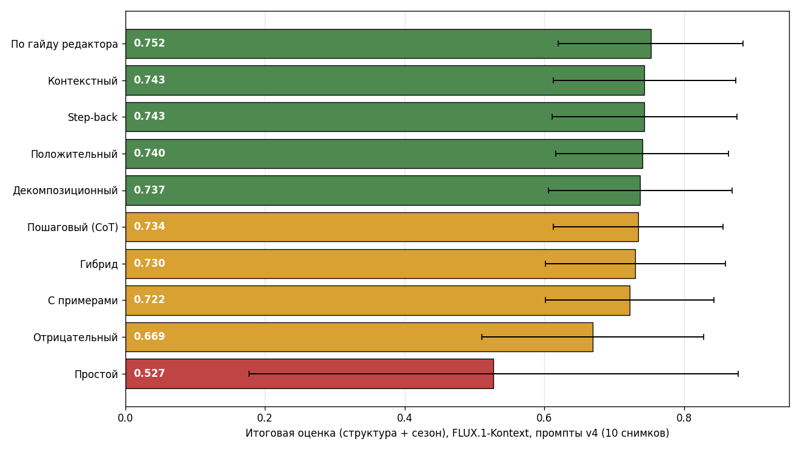

Как читать таблицу. Все оценки - от 0 до 1, чем больше, тем лучше. «Итоговая оценка» - главный столбец, по нему строится рейтинг (структура с весом 0.6 плюс сезон с весом 0.4). «Структура» показывает, насколько сохранилась исходная сцена, «Сезон» - насколько выражено время года. «Дисквалификаций» - на скольких из 40 снимков структура упала ниже порога и результат был отброшен. «Значимость против лидера» - результат парного теста: «не отличается» значит, что разница с лучшим типом в пределах случайности (p больше 0.05), «хуже» - что отставание статистически подтверждено.

Два столбца - средняя оценка и значимость - могут расходиться, и это не ошибка: рейтинг строится по среднему, а значимость - по парному сравнению на одинаковых снимках. Гибрид со средним 0.730 стоит выше «с примерами» (0.722), но помечен как значимо худший, тогда как «с примерами» - нет. Причина в разбросе: гибрид стабильно чуть ниже лидера на каждом снимке (маленькая, но устойчивая разница проходит тест), а «с примерами» сильно колеблется от снимка к снимку, поэтому его отставание тонет в шуме. Именно поэтому на большей выборке (раздел 8.4) картина проясняется.

Разница между типами хорошо видна на одном исходном снимке в осень. Слева исходник, далее восемь исходных типов промптов (кадр из базового прогона; типы step-back и декомпозиционный добавлены позже). Подписи под кадрами: zero_shot - простой, contextual - контекстный, positive - положительный, negative - отрицательный, few_shot - с примерами, cot - пошаговый, kontext_guide - по гайду редактора, hybrid - гибрид:

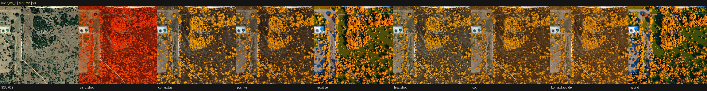

Контекстно-ограничивающие типы (по гайду редактора, контекстный, положительный, с примерами, пошаговый) дали золотую осеннюю растительность при полностью сохраненной сцене - тропа, кустарник и открытые участки на своих местах. Простой промпт залил снимок сплошным красным тоном и потерял детали, а отрицательный и гибрид первой версии (с отдельным механизмом запретов) перенасытили цвета и местами изменили содержимое сцены. Это же видно и в числах таблицы.

Промпт-победитель - тип «по гайду редактора» (по сути контекстно-ограничивающая формулировка, развитие контекстного типа из раздела 6). Он состоит из трех частей: команда смены сезона с конкретными признаками, требование менять только условия среды вокруг построек и явная фиксация расположения объектов, ракурса и кадрирования. Общая часть одинакова для всех сезонов, меняется только сезонный блок в начале:

> Change the season to [СЕЗОН]: [сезонные признаки]. Only replace the environmental conditions around the structures. Maintain identical placement of every road, building, parking lot and field boundary, and keep the same camera angle, framing and perspective. Do not add or remove any objects.

Сезонные блоки, которые подставляются в начало:

- **лето:** `summer: lush green vegetation, green trees and grass, dry bare ground, warm daylight, no snow`
- **осень:** `autumn: yellow and orange foliage, fading vegetation, golden and brown tones, some bare trees, no snow`
- **зима** (после доработки, раздел 8.3): `winter: very light first snowfall: thin white patches scattered between bare dark vegetation and soil, most of the ground and roads still snow-free and clearly visible, pale cold light; do not cover the entire ground with snow`
- **глубокая зима:** `deep winter: heavy thick snow covering the entire ground and rooftops, frozen surfaces, strong cold white palette, snow-laden bare trees`

Как этот промпт отрабатывает на одном снимке во всех четырех целевых сезонах (слева - исходный летний снимок, далее лето, осень, зима, глубокая зима; дороги, дома и границы участков сохраняются, меняется только сезонное состояние поверхности и растительности):

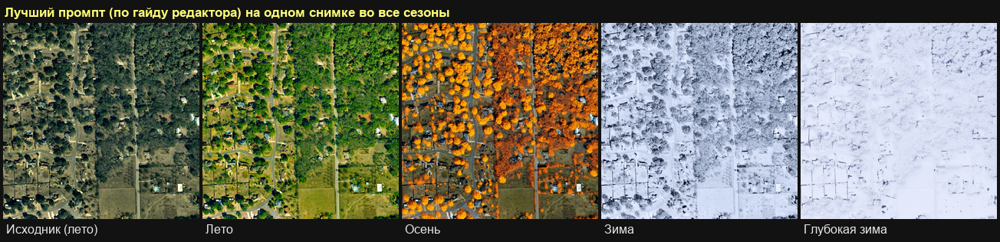

Выводы по промптам:

- Лучшие результаты дают контекстно-ограничивающие промпты (по гайду редактора, контекстный, декомпозиционный, step-back). На 10 снимках они статистически неразличимы между собой; расширение выборки до 36 снимков разделяет их и выводит «по гайду редактора» в однозначные лидеры (раздел 8.4). Общая черта - явное указание сохранить расположение дорог, зданий и границ участков.
- Отрицательный промпт значимо хуже (p < 0.001). Его отдельный список запретов у этой модели реализуется через отдельный механизм (усиленную подсказку), который уводит результат от исходной сцены и снижает сохранение структуры: 0.621 против 0.768 у лидера. Для данной модели переносить запреты внутрь основного промпта эффективнее, чем задавать их отдельно: гибрид после такого переноса вырос с 0.625 до 0.708 (в финальной версии v4 - 0.730; подробнее в разделе 8.3).
- Добавленные позже типы step-back и декомпозиционный сразу вошли в лидирующую группу: развернутая структура инструкции работает, если запреты остаются внутри основного промпта.
- Простой промпт наименее надежен: в 11 случаях из 40 он полностью разрушил сцену (модель нарисовала другую местность). Автоматика это поймала по низкому сходству структуры, визуальная проверка подтвердила.

#### 8.2. Выраженность по сезонам

Летний вид получается легко (исходные снимки летние). Осень и глубокую зиму основная модель передает уверенно. Зима выражается слабее: модель склонна генерировать сплошной плотный снег, из-за чего результат распознается ближе к глубокой зиме. Это наблюдение стало основанием для целевого зимнего эксперимента, описанного ниже.

#### 8.3. Итерационное улучшение промптов

Формулировки дорабатывались по данным метрик в три версии.

Версия 2 → 3. Запреты гибрида перенесены из отдельного отрицательного механизма внутрь основного промпта - оценка гибрида выросла с 0.625 до 0.708, что подтвердило вывод о вреде отдельного механизма запретов. Попытка мягко переописать зиму («тонкий неоднородный снег») без смены основной лексики результата не дала: зимняя оценка на полной выборке из десяти снимков осталась прежней (0.566 против 0.563).

Версия 3 → 4: зимний эксперимент. Чтобы быстро перебрать формулировки, эксперимент велся на подвыборке из **четырех снимков**, где зима выражалась хуже всего (поэтому абсолютные числа в таблице ниже, чем на полной выборке). При двух лидирующих типах промптов проверены три варианта зимней формулировки и один вариант глубокой зимы. Базовая версия на этом сложном наборе давала 0.484:

| Вариант | Итоговая оценка | Структура | Сезон | Решение |
| --- | --- | --- | --- | --- |
| База (версия 3) | 0.484 | 0.532 | 0.411 | - |
| W1: лексика «первый снегопад» | 0.624 | 0.718 | 0.484 | лучше базы |
| W2: W1 + явный запрет сплошной заливки снегом | 0.612 | 0.702 | 0.478 | лучше базы |
| W2 + сила подсказки 3.5 вместо 2.5 | 0.642 | 0.748 | 0.483 | принят |
| D1: «расчищенные дороги» для глубокой зимы | 0.559 | 0.436 | 0.744 | отклонен |

Смена лексики с описания состояния («легкий снежный покров») на описание события («очень легкий первый снегопад, большая часть земли и дорог без снега») решила главную проблему: модель перестала заливать сцену сплошным снегом, структура выросла с 0.53 до 0.75. Повышение силы подсказки до 3.5 добавило еще немного. Разница видна на одном из сложных снимков (слева исходник, далее два лидирующих типа промпта):

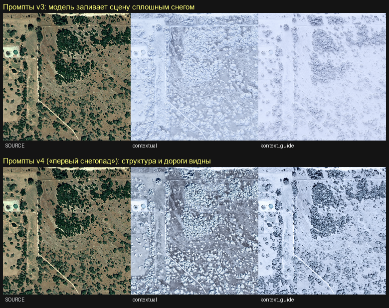

Вариант D1 для глубокой зимы показателен как контрпример: сезон выразился максимально (0.744), но структура упала ниже базы - «расчищенные дороги» модель поняла как разрешение перерисовать дорожную сеть. Вариант отклонен: для задачи поиска изменений структура важнее выразительности.

Принятая формулировка вошла в финальную версию промптов (она приведена в разделе 8.1). На **полной выборке из десяти снимков** этот же зимний промпт поднял среднюю зимнюю оценку с 0.563 (версия 3) до 0.654 (версия 4) - именно это улучшение +0.091 фигурирует в итогах раздела 9. Прочие сезоны при этом не пересчитывались и совпали бит-в-бит (обработка детерминирована при фиксированном начальном значении генератора).

#### 8.4. Расширенная проверка и разделение лидеров

Финальный прогон на 10 снимках оставлял лидирующую группу статистически неразличимой. Чтобы разрешить это, четыре лучших типа промптов прогнаны на увеличенной выборке - 36 снимков LEVIR-CD против 10, то есть 144 пары сравнения на тип вместо 40. На такой выборке разница становится значимой:

| Тип промпта | Итоговая оценка | Значимость против лидера (парный тест) |
| --- | --- | --- |
| По гайду редактора | 0.753 | лидер |
| Step-back | 0.735 | хуже (p < 0.001) |
| Контекстный | 0.732 | хуже (p < 0.001) |
| Декомпозиционный | 0.725 | хуже (p < 0.001) |

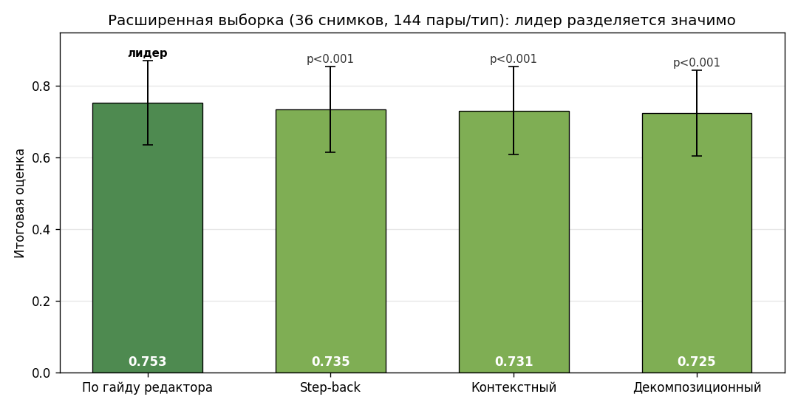

(Средние значения здесь - 0.753 у лидера против 0.752 на 10 снимках в разделе 8.1 - это разные прогоны, отличаются в третьем знаке из-за большего числа снимков.) На графике видно, почему это важно: столбцы усредненных оценок близки, а усы разброса перекрываются, поэтому на 10 снимках типы неразличимы. Но парный тест сравнивает типы на *одних и тех же* снимках и гасит разброс между снимками - на 144 парах устойчивая разница в 0.02-0.03 становится значимой. Так увеличение выборки не подняло абсолютные числа (потолок уже достигнут), но окончательно определило лучший тип промпта: **формулировки по официальному гайду редактора** значимо опережают все остальные (p < 0.001 против каждого). Это главный практический вывод работы.

Дополнительно проверены два вопроса из бизнес-ТЗ.

- **Устойчивость к случайности.** Лидирующие типы прогнаны с тремя разными начальными значениями генератора (основной прогон и два дополнительных). Средний разброс итоговой оценки по трем запускам - 0.032; у лидера он наименьший (0.025), у 84% комбинаций не превышает 0.05. То есть выбор промпта устойчив: результат мало зависит от конкретного зерна генерации, а лучший тип остается лучшим и стабильнее прочих.
- **Абляция силы подсказки.** Проверено повышение силы подсказки с 2.5 до 3.5 на всех сезонах (а не только зимой). Средний прирост +0.005 статистически незначим (p = 0.41): зима слегка выигрывает (+0.021), глубокая зима столько же теряет (−0.011). Вывод: глобально повышать силу подсказки не стоит, зимняя доработка из раздела 8.3 уже сняла основной эффект.

Также проверена еще одна формулировка для глубокой зимы - «дорожная сеть и контуры зданий едва просматриваются под снегом». На четырех самых сложных снимках она выглядела перспективно (структура +0.018), поэтому была проверена на полной выборке из десяти снимков. Здесь эффект не подтвердился: прирост структуры сжался до +0.003, итоговой оценки - до +0.006 при p = 0.65 (формулировка выигрывает лишь в 11 парах из 20 - на уровне случайности). Вывод: улучшение на четырех снимках оказалось артефактом малой выборки, поэтому формулировка в финальные промпты не внесена. Этот же результат подтверждает общий вывод работы - потолок качества по промптам достигнут, дальнейшие микроформулировки уже неотличимы от шума.

#### 8.5. Сравнение моделей

До сих пор речь шла об одной модели - FLUX.1-Kontext. Осталось проверить, действительно ли она подходит для задачи лучше других редакторов. Те же промпты прогнаны через еще две модели - Stable Diffusion XL в режиме image-to-image и InstructPix2Pix.

Итоговая оценка сама по себе может вводить в заблуждение: модель, которая почти не меняет изображение, получает высокую оценку структуры, не выполняя задачу. Поэтому дополнительно считается доля успешных результатов - тех, где целевой сезон действительно выражен и сцена при этом не разрушена. Летние генерации из этого подсчета исключены, так как исходные снимки и без того летние; столбцы структуры и сезона усреднены по всем сезонам:

| Модель | Доля успешных | Структура | Сезон | Дисквалификаций |
| --- | --- | --- | --- | --- |
| FLUX.1-Kontext | 65% | 0.672 | 0.716 | 13 |
| SDXL image-to-image (сила 0.45, по умолчанию) | 39% | 0.709 | 0.583 | 1 |
| SDXL image-to-image (сила 0.60, подобранная) | 50% | 0.632 | 0.626 | 4 |
| InstructPix2Pix | 34% | 0.819 | 0.594 | 0 |

Выводы по моделям:

- FLUX.1-Kontext - единственная модель, которая одновременно выражает сезон и сохраняет структуру. Она уверенно передает осень и глубокую зиму; зима дается слабее (причина разобрана в разделе 8.2).
- InstructPix2Pix почти не меняет сцену: структура высокая, но сезон получается как цветной фильтр поверх исходника (например, синеватый оттенок вместо реального снега). Визуальная проверка это подтвердила.
- SDXL на настройке по умолчанию (сила изменения 0.45, верхняя из двух строк) имеет обратную проблему: структуру он сохраняет даже лучше основной модели (0.709 против 0.672), но сезон выражает слабо (0.583) - почти не трогает сцену, и зимний снимок остается близким к летнему. Как выяснилось при отдельной проверке (ниже), это во многом артефакт консервативной силы изменения, а не предел модели: при ее повышении сезон подтягивается (вторая строка), но уже ценой структуры. Кроме того, у моделей семейства Stable Diffusion текстовый кодировщик обрезает длинные промпты до 77 токенов, поэтому подробные формулировки (с примерами, пошаговые) у них теряют часть инструкции.

Наглядно разница видна на одном исходном снимке в глубокую зиму (слева исходник, далее результаты восьми типов промптов). FLUX.1-Kontext добавляет плотный снежный покров, сохраняя расположение объектов. Здесь же виден пример полного разрушения сцены: простой промпт (второй кадр) вместо аэрофотоснимка сгенерировал ночной еловый лес с ракурсом сбоку - именно такие результаты автоматически дисквалифицируются по низкому сходству структуры:

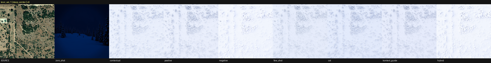

InstructPix2Pix на том же снимке лишь подкрашивает изображение в холодный оттенок: растительность и открытая земля остаются летними, реального снега нет:

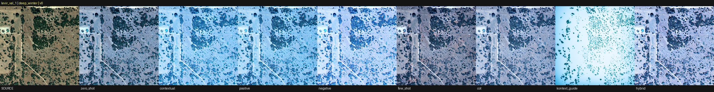

SDXL на том же снимке (сила изменения 0.45, по умолчанию) сохраняет геометрию, но снега почти не добавляет - растительность и грунт остаются летними, поэтому по сезону результат проваливается (обратная проблема к InstructPix2Pix - структура цела, а сезона нет):

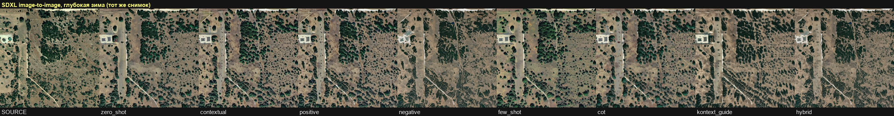

Слабый сезон у SDXL - во многом следствие этой настройки. У режима image-to-image главный параметр - сила изменения (strength): при 0.45 сохраняется около половины исходника, поэтому летний снимок почти не меняется. Чтобы дать SDXL честный шанс, тот же полный набор (10 снимков, 8 типов, 4 сезона) прогнан заново при силе 0.60. Доля успешных выросла с 39% до 50%, сезон - с 0.583 до 0.626, но структура упала с 0.709 до 0.632 (обе строки SDXL - в таблице выше). То есть 0.45 действительно занижало модель, но и на подобранной силе SDXL не догоняет FLUX.1-Kontext (50% против 65%): сезон у него растет только вместе с потерей структуры.

Саму развилку видно на коротком свипе по силе (4 самых сложных снимка, один тип промпта):

| Сила изменения | Структура | Сезон | Доля успешных |
| --- | --- | --- | --- |
| 0.45 (по умолчанию) | 0.742 | 0.423 | 25% |
| 0.60 | 0.635 | 0.559 | 67% |
| 0.75 | 0.569 | 0.592 | 58% |

На этих четырех сложных снимках сезон при 0.60 подскакивает, но с ростом силы структура монотонно падает, а при 0.75 сцена начинает разрушаться: модель дорисовывает несуществующую застройку, из-за чего доля успешных снова снижается. В этом ключевое различие: у SDXL сезон и структуру приходится балансировать одним параметром, тогда как инструкционный редактор FLUX.1-Kontext дает и то, и другое сразу, без подбора. Развилка видна на одном снимке в глубокую зиму - от почти летнего кадра при 0.45 до потери сцены при 0.75:

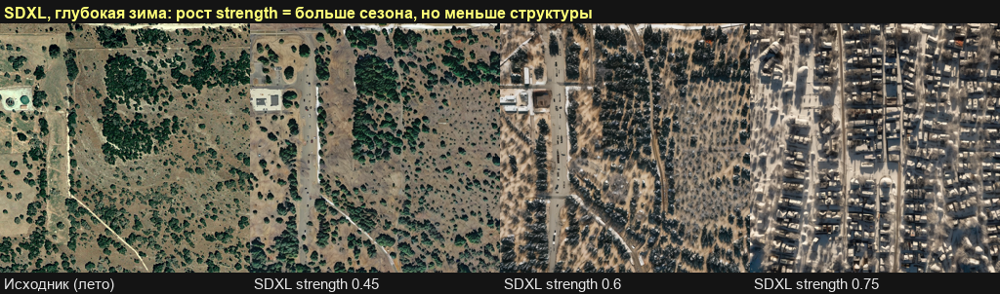

Отдельно проверено, дает ли выигрыш более крупная модель. Лучшие типы промптов прогнаны через FLUX.2 (32 миллиарда параметров) на подвыборке снимков и сезонов. Сравнение честное - на одних и тех же парах (снимок, сезон, тип): итоговая оценка FLUX.2 составила 0.689 против 0.676 у основной модели на этой же подвыборке (числа ниже, чем 0.752 в разделе 8.1, потому что подвыборка включает трудные зимние снимки) - прирост менее двух процентов. Заметный выигрыш только на зиме (вероятность распознавания зимы 0.55 против 0.22 на промптах до зимней доработки), при этом одно изображение генерируется 97 секунд вместо 18. Вывод: замена модели на более крупную не окупается - уточнение зимнего промпта (раздел 8.3) закрывает тот же разрыв без пятикратного роста стоимости.

### 9. Итоги практики

В ходе практики было изучено применение нейросетевых моделей для задачи поиска изменений на аэро- и спутниковых снимках и подготовлено рабочее решение для сезонной генерации изображений с оценкой качества промптов.

Основные результаты:

- Разработан воспроизводимый конвейер: чтение снимков через GDAL, генерация сезонных вариантов инструкционным редактором FLUX.1-Kontext, сохранение параметров каждого запуска, числовая оценка, автоматическая валидация и сравнение промптов. Всего оценено 3044 генерации по сохраненным прогонам.
- Подготовлено десять типов промптов и объективная система оценки, которая измеряет одновременно сохранение структуры и выраженность сезона, а вывод о лучшем промпте делает по статистической значимости, а не на глаз.
- На реальных прогонах показано, что лучший результат дают контекстно-ограничивающие промпты с явным требованием сохранить расположение объектов. На расширенной выборке (36 снимков, 144 пары сравнения на тип) лучший тип определен статистически значимо: формулировки по официальному гайду редактора (оценка 0.753) опережают все остальные с p < 0.001. Отрицательные промпты с отдельным механизмом запретов работают значимо хуже, а простой промпт ненадежен: он разрушил сцену в 11 случаях из 40.
- Промпты улучшены итерациями по данным: перенос запретов внутрь основного промпта поднял гибрид на 0.083 (0.625 -> 0.708), а смена зимней лексики на «первый снегопад» с запретом сплошной заливки подняла зимнюю оценку с 0.563 до 0.654 (+0.091).
- Выбор промпта устойчив к случайности генерации (разброс по трем начальным значениям 0.03, у лидера меньше), а повышение силы подсказки сверх базовой глобального выигрыша не дает - показано абляцией.
- Сравнение четырех моделей показало, что инструкционный редактор FLUX.1-Kontext подходит для задачи лучше альтернатив. InstructPix2Pix почти не меняет сцену (доля успешных 34%). SDXL на настройке по умолчанию тоже слаб по сезону (39%), и это отчасти артефакт силы изменения: при ее подборе до 0.60 доля успешных на полном наборе растет до 50%, но SDXL все равно уступает FLUX (65%), потому что сезон у него улучшается лишь ценой структуры - оба показателя приходится балансировать одним параметром, тогда как FLUX.1-Kontext дает их сразу. Более крупная FLUX.2 дает прирост менее двух процентов при пятикратной цене генерации.

Главный результат работы - не сами сгенерированные изображения, а проверенный набор промптов и статистически обоснованный вывод о том, какие формулировки лучше подходят для сезонного расширения обучающей выборки в задаче поиска изменений: лучший тип промпта определен не на глаз, а по значимому преимуществу на расширенной выборке, и подтвержден проверками устойчивости.
